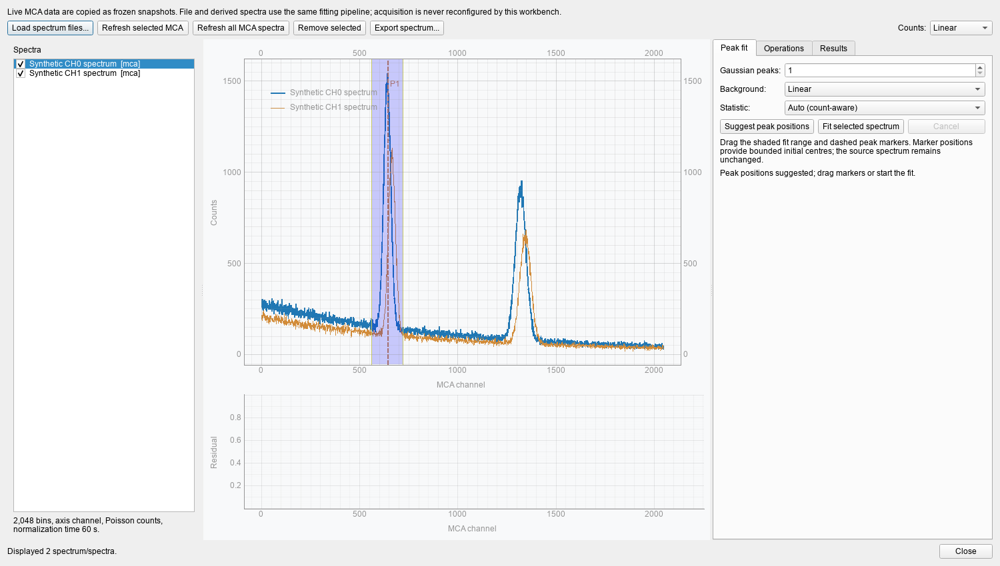

Offline tools are deliberately separate from live acquisition. Loading a file
or refreshing a frozen spectrum does not start, stop, clear, or reconfigure the
hardware measurement that produced it.

## MCA energy calibration

Open **Tools → MCA Energy Calibration...**, select a channel, and copy its
current spectrum. Double-click known peaks to add draggable reference lines and
enter their expected energies.

- two enabled references are required for a linear fit;
- three are required for a quadratic fit;
- the table reports individual residuals plus RMS and maximum residual;
- overlays from other sources are accepted only when energy-processing
  settings are compatible.

A spectrum copied while the MCA is running is labelled a live, non-atomic
snapshot. Applying calibration changes no FPGA register, bin, ROI, or raw
record. Raw channel remains the bottom axis and calibrated keV is added on the
top axis. Relevant DSP changes mark the calibration stale; power-of-two MCA
binning changes rescale coordinates without invalidating an otherwise matching
calibration.

Saved settings and later capture metadata retain reference points,
coefficients, residuals, and the energy-processing fingerprint.

## Peak-analysis workbench

Open **Tools → MCA Peak Analysis Workbench...**. It works on frozen copies of
live MCA spectra and also imports:

- ordinary or NLab CSV;
- Maestro/ORTEC-style `.Spe`;
- Tukan `.wdm`;
- CAEN calibrated `.txt3`;
- CAEN ROOT `Energy` histograms.

One to three Gaussian components can be combined with none, constant, linear,
centred exponential, error-function Compton-step, or logistic Fermi-step
backgrounds. Draggable markers seed and bound peak centres. Raw non-negative
counts use a Poisson-deviance fit; derived spectra use propagated variance.

Results include centroid, FWHM, area, resolution, uncertainty, reduced fit
statistic, AIC/BIC, component curves, residuals, and boundary/covariance
warnings. Spectrum arithmetic creates new immutable entries, requires matching
coordinate grids, propagates variance, and never interpolates silently.

The following workbench view contains deterministic synthetic spectra. It is a
UI example generated without hardware or network I/O, not a captured MCA
result.

## PSD event readback

Open **Tools → PSD Event Readback...** to reconstruct energy/PSD matrices and
projections from:

- NLab NDMA v1/v2;
- CAEN CoMPASS or compatible legacy CAEN binaries;
- NLab HDF5;
- ROOT event trees.

The reader memory-maps binary files, slices HDF5, and iterates ROOT in chunks.
Memory therefore stays bounded by batch size rather than total file length.
CAEN PSD import requires raw Energy and Energy Short fields. Headerless
single-channel extracts are accepted only after conservative structural checks.

## Waveform analysis and PSD reconstruction

Open **Tools → Waveform Analysis Workbench...** for native NLab Scope NDMA or
waveform-bearing CAEN CoMPASS data. NLab fixed frames are memory-mapped directly.
Variable-length CAEN files receive a background offset index, and only selected
frames are copied for display.

The workbench provides:

- median or mean baseline removal;
- automatic or explicit pulse polarity;
- draggable integration start, short-end, and long-end gates;
- `Qshort`, `Qlong`, and `(Qlong - Qshort) / Qlong`;
- energy-versus-ratio matrices and linked projections;
- event stride and maximum-event limits;
- debounced previews while gates are dragged;
- comparison with stored CAEN gate sums when available.

NLab Scope NDMA uses its known 8 ns stored-point period. CoMPASS waveform files
do not encode the ADC sample period; verify the operator-entered value for the
originating digitizer.

## Two-channel timing validation

Use **Developer → Validate Two-Channel Timing...** with two native NLab MCA
files produced from one known pulse split between channels (lower channel in
A). The validator scans complete files for backwards timestamps, verifies time
overlap, and plots bounded nearest-neighbour delay samples.

A fixed channel-B offset in 8 ns steps can be saved in application settings and
YAML. Matching identity metadata or a narrow histogram does not prove shared
clock timing; verify against the known split-pulse setup. These nearest-neighbour
pairs are diagnostics, not coincidence counts.

## Coincidence matrices

The live Coincidence workspace produces prompt, delayed-random, and corrected
energy matrices, plus projections and timing diagnostics. Exported HDF5/ROOT
matrices preserve raw axes, gates, calibration metadata, and session state. See
[Coincidence Measurement](coincidence).

## Programmatic recipes

- [Scope Waveform Analysis](analyze_scope)
- [MCA List-Mode Analysis](analyze_listmode)

Use these recipes when automation is required. Prefer project readers over
hand-written binary offsets because they enforce current NDMA versions,
alignment, and bounded-memory behavior.
