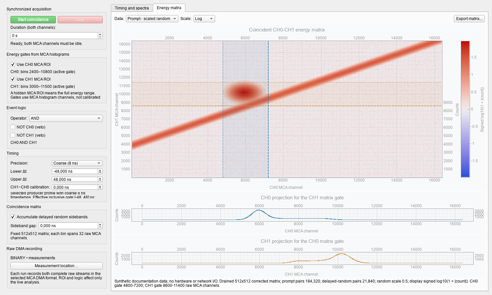

The **Coincidence** workspace performs live two-channel logic from current-IIO
MCA list-mode streams. It requires two compatible list-mode channels and the
shared software-start core. The workspace owns both DMA streams for the whole
session.

## Before starting

1. Verify both physical channels and load compatible MCA settings.
2. Configure CFD on both MCAs if fine timing will be used.
3. Set and show the energy ROIs in the two MCA histograms if they should gate
   coincidence events.
4. Validate the relative channel delay with a known common-input split before
   treating a timing peak as detector performance.
5. Select the MCA DMA output mode. A recorded coincidence run applies that mode
   to both streams.

Starting coincidence sets external start on both MCAs, arms both IIO readers,
and raises the shared software-start level only after both report ready. Stop,
timeout, or failure gates start off and drains both channels.

## Energy gates

Enable **Use CH0 MCA ROI** and/or **Use CH1 MCA ROI** to apply the visible MCA
ROI. A hidden ROI or an unchecked option accepts the complete raw MCA-channel
range. The accepted-energy plots show applied ROIs as shaded bands and inactive
ROIs as muted references.

The current qualified producer maps its 16-bit selected-energy field into the
14-bit MCA channel as:

```text
energy_channel = energyRaw >> 2
```

Do not shift again by the MCA histogram binning selector. This mapping has been
cross-checked with paired captures but is not described by the driver's opaque
record ABI; repeat a labelled-source check after a producer/firmware change.

## Logic modes

| Rule | Meaning |
|---|---|
| `CH0 AND CH1` | Emit every ROI-qualified pair inside the inclusive timing gate |
| `NOT CH0 AND CH1` | Accept a CH1 anchor only when no qualified CH0 event is inside its window |
| `CH0 AND NOT CH1` | Symmetric CH0 anti-coincidence |
| `OR` | Union of eligible singles |
| `XOR` | Eligible singles with no opposite-channel event inside the window |

NOT does not invert an energy ROI. Both-NOT and NOT combined with OR/XOR are
deliberately unavailable.

One event may participate in several AND pairs. The GUI therefore distinguishes
pair count, unique participating events per channel, and anchors with multiple
partners. Do not use the pair count as a synonym for unique physical pulses.

## Timing convention

The signed raw difference is:

```text
delay = CH1 event time - CH0 event time
```

The measured CH1-minus-CH0 common-input delay is then **subtracted** as the
channel calibration. Bounds are inclusive and decimal nanosecond values are
converted to exact internal integer coordinates.

Precision defaults to **Coarse (8 ns)**. Fine mode requires valid CFD records
on both MCAs and uses the qualified `vdpp-zc-calc-q2.14-v1` profile:

```text
eventTime_ns = 8 * timestampTicks
             + 2 * (uint8(zcOffset) + int16(fineRaw) / 16384)
```

`fineRaw` must lie in `[-16384, 0]`. PSD marker `0x08` takes priority over CFD
marker `0x02`; ineligible records are counted and excluded. Arithmetic remains
integer in units of 1/8192 ns until bounded display differences are formed, so
large uint64 timestamps keep adjacent ticks. The displayed delay histogram uses
exact 62.5 ps bins.

`zcOffset` is unsigned and can wrap modulo 256. The client reports boundary
crossings but never guesses an unwrap. A producer configuration that overflows
this field is not qualified for fine timing.

With enough pairs and a significant local maximum, the GUI overlays a guarded
constant-background Gaussian-core fit. It reports centre, FWHM, formal
uncertainty, fitted signal count, and reduced chi-square. A poor-fit warning or
a narrow fitted core is not by itself a complete detector CTR result.

## Energy matrix and random subtraction

Ordinary AND analysis fills a 512 × 512 matrix. Rows are CH1, columns are CH0,
and each matrix bin spans 32 raw MCA channels. Raw channels remain on the bottom
and left axes; valid MCA energy calibrations provide keV labels on the top and
right axes.

Movable vertical and horizontal display gates project selected CH1 and CH0
populations. They do not alter acquisition or prompt-pair counting.

Matrix modes are:

- prompt pairs;
- the combined delayed-random sidebands;
- prompt minus scaled random.

The two delayed sidebands each have the prompt-window width and are separated
by a configurable gap. Their combined matrix is multiplied by 0.5 before
subtraction. Corrected logarithmic display uses a sign-preserving
`sign(count) * log10(1 + abs(count))` transform. Matrix analysis is unavailable
for veto, OR, and XOR because those rules do not produce two-member pairs.

The screenshot below is a synthetic GUI example generated without hardware or
network I/O. The matrix populations and counts are illustrative, not detector
measurements.



## Recording and finalization

A recorded run creates channel-specific files (`..._ch0`, `..._ch1`) plus a
common `_session.yaml` manifest. Binary output keeps per-channel YAML and JSON
sidecars; HDF5 and ROOT embed configuration metadata. Online-only creates no
capture files.

The session manifest records the timing equation, channel-delay sign, inclusive
gate, pairing policy, schema profile, and available transport identity. Live
results remain provisional until both fixed-frame streams stop and drain.

The current producer can pad the final 1,024-record frame with zero records but
does not publish an exact valid-record count. Ambiguous zero-time padding is
reported rather than silently treated as a real coincidence or an infallible
end marker.

Prompt, random, and corrected matrices can be exported to HDF5 or ROOT without
overwriting an existing file. Exports include raw-channel edges, timing and
display gates, calibration metadata, and session diagnostics.

## Validation checklist

- Both readers reported ready before shared start.
- No driver DMA fault, completed-frame mismatch, or list deadtime was reported.
- The two streams overlap in time and the final drain completed.
- The channel-delay sign was verified with a known split input.
- Fine mode shows no unacceptable `zcOffset` boundary behaviour.
- Energy mapping was checked after any producer/firmware change.
- Pair counts are interpreted separately from unique-event counts.

See [Capture Files and Integrity](data_formats) for file metadata and
[Troubleshooting](troubleshooting) for list-mode transport failures.
