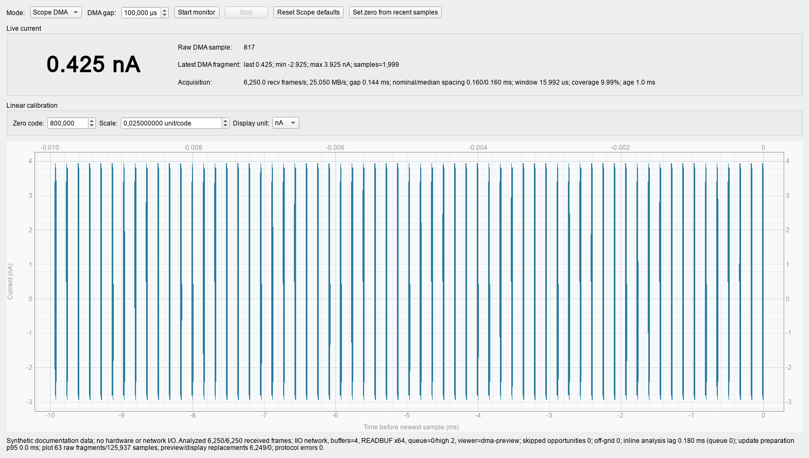

The per-channel **Current** workspace provides two ways to observe the detector
current path: a lightweight scalar IIR readout and a timestamped Scope DMA
waveform. They are different raw signals and should not be compared as though
they were interchangeable current measurements.

## Choose an acquisition mode

| Mode | Data delivered | Timing | Use it when |
|---|---|---|---|
| **IIR polling** | One signed FPGA input-filter code per transaction | Host transaction midpoint; target spacing is 1 ms | You need a low-overhead trend or a scalar value for control/logging |
| **Scope DMA** | Complete timestamped Scope waveform frames | FPGA timestamps and driver-advertised sample geometry | You need the raw waveform, coverage diagnostics, or sample-weighted statistics |

Neither source is expressed in amperes until it has been calibrated for the
connected sensor and analogue front end.

## GUI workflow

1. Open the **Current** workspace for the required channel.
2. Select **IIR polling** or **Scope DMA**.
3. Enter or load the appropriate zero, scale, and display unit if calibrated
   current is required.
4. In DMA mode, set the post-frame **DMA gap** while the monitor is stopped.
5. Press **Start monitor**. Press **Stop monitor** before changing ownership of
   the Scope or closing the application.

When the input is in a known zero-current condition, **Set zero from recent
samples** fills `zero_code` from the recent measurement window. Supply the
independently established `scale_per_code` and unit to complete the linear
calibration.

The monitor deliberately starts stopped. Merely opening the workspace does not
create a polling connection or arm DMA.

The screenshot below uses deterministic synthetic data and performs no
hardware or network I/O. Its values illustrate the controls and diagnostics;
they are not a measurement result.



### IIR polling

IIR mode reads the input filter's signed output through a connection owned by
the polling worker. The GUI requests 1,000 reads/s and timestamps each sample
at the midpoint of the host transaction. Because the driver's
`in_voltage0_raw` attribute has no IIO buffer or hardware timestamp, this is a
requested host cadence rather than a guaranteed 1 ms hardware grid.

The GUI reports the measured rate, median transaction latency, age of the
newest sample, and any bounded-buffer loss. Numeric rendering is limited to
30 Hz even when polling is faster; this display limit does not change the raw
values already accepted into the rolling history.

### Scope DMA

DMA mode is online-only and requires the direct IIO backend. It owns the
channel's Scope DMA path, so a separate Scope recording cannot run at the same
time. The trigger level and DAC baseline currently shown in Scope are applied
unchanged when monitoring starts. Periodic triggering does not evaluate the
trigger threshold, but preserving it keeps the previous Scope operating point
available for later edge/level modes. The DAC baseline affects every waveform.

On IP122 the monitor selects the live-qualified maximum-coverage preset:

- 8,188 configured samples;
- zero pretrigger;
- periodic trigger;
- 12,500 datapath cycles, or 100 us, of post-frame gap.

Earlier firmware keeps the visible Scope geometry because the IP122 preset has
not been qualified there. The DMA-gap editor accepts exact 8 ns steps from 0
through 524.280 us. A shorter requested gap does not guarantee that every
trigger opportunity reaches the host; skipped opportunities remain visible in
the FPGA timestamp diagnostics.

Every complete frame is validated and reduced on the receiver thread before a
replaceable preview is published. Signed sums and sample counts feed 100 ms
sample-weighted bins. The GUI retains a bounded 10 ms window of raw waveform
fragments, draws breaks over uncovered time, refreshes scalar values at no more
than 30 Hz, and paints the waveform at 2 Hz. A slow display can replace preview
frames, but it does not remove already received samples from the scientific
accumulator.

With the qualified IP122 periodic layout, each transported waveform word is
already the FPGA-provided mean of four ADC samples and represents 8 ns. The
client performs no additional waveform averaging and cannot reconstruct the
four original 2 ns ADC samples.

## Calibration and displayed values

The saved linear calibration is:

```text
current = (raw_code - zero_code) * scale_per_code
```

`zero_code` is the measured baseline in the selected mode.
`scale_per_code` includes magnitude and sign in the selected unit. Available
display units are A, mA, uA, nA, and pA.

Calibrate IIR and DMA against the intended physical reference instead of
copying a scale between them:

- IIR presents the normalized FPGA input-filter result.
- DMA presents the Scope waveform code transported by the FPGA.

In DMA mode, the large raw readout is the newest waveform word. The fragment
summary reports the last, minimum, maximum, and number of samples in that
fragment. Interval statistics use all accepted samples, not one average value
per displayed frame.

## Minimal headless example

[`examples/measure_current.py`](https://github.com/nucliflare/nlab-digitizer-community/blob/main/examples/measure_current.py)
demonstrates both acquisition paths without the GUI:

```bash
uv run python examples/measure_current.py
```

Edit `URI` and `CHANNEL` for the target. `USE_DMA = False` selects IIR;
`USE_DMA = True` selects Scope DMA. Both functions run continuously without an
artificial `sleep()` and stop on Ctrl+C.

The example produces raw codes. It does not apply the GUI's saved calibration.
DMA mode configures and stops the Scope but intentionally keeps the example
small and does not restore the previous Scope settings. Use an idle channel
and reapply the required Scope configuration afterward.

### What is a callback?

A callback is a function passed to the measurement function. The measurement
code calls it whenever new data is ready:

```python
def show_iir(raw_code: int) -> None:
    print(raw_code)

measure_current_iir(digitizer, callback=show_iir)
```

The IIR callback receives one `int`. The DMA callback receives the latest
NumPy `int16` waveform. A callback can:

- convert raw codes to calibrated current;
- update a plot or scalar display;
- record values in a file or database;
- calculate statistics or alarms;
- enqueue data for a separate processing worker.

The callback's return value is ignored. An exception raised by it ends the
measurement, after which the example's `finally` blocks perform cleanup.

IIR invokes the callback directly in its read loop, so slow file, network, or
calculation work reduces the IIR sampling rate. For expensive work, make the
callback enqueue the value into a bounded queue and let another thread consume
that queue.

DMA capture already runs on its own thread. The caller drains a one-frame
buffer and passes only the newest complete waveform to the callback. A slow DMA
callback therefore does not block capture, but intermediate preview frames can
be replaced. Code that must process every frame should use a dedicated capture
pipeline with an explicitly sized queue and backpressure policy instead of the
minimal latest-frame example.

## Stopping and ownership

For DMA, shutdown order matters: stop the acquisition core, signal the capture
to finish, cancel a blocked refill, wait for the capture thread, destroy the
native IIO buffer, and only then close the `Digitizer`. The GUI and minimal
example implement this lifecycle. Do not write the DMA ownership gate directly.

After GUI Current DMA stops, the temporary DMA selection is cleared. If the
optimized IP122 settings are no longer wanted, press **Reset Scope defaults**
while monitoring is stopped. A latched DMA transport fault must be acknowledged
through the existing recovery workflow before another session is armed.

## Diagnostics

The Current workspace separates configured timing from observed transport
behavior. It reports:

- configured post-frame gap and nominal start-to-start spacing;
- measured FPGA timestamp spacing and skipped opportunities;
- host receive rate in frames/s and decimal MB/s;
- timestamp-derived waveform coverage;
- received, analysed, rejected, and preview-replaced frames;
- protocol errors, analysis lag, and GUI render preparation time;
- active transport, kernel-buffer, and READBUF policy.

Two specialized diagnostics are available:

```bash
# Synthetic GUI/render profile; performs no hardware I/O.
uv run python examples/current_monitor_gui_profile.py

# Direct-IIO receiver and optional rendered-widget diagnostic.
uv run python examples/current_monitor_dma_diagnostic.py \
  --host 192.168.10.135 --frame-samples 8188 \
  --gap-cycles 12500 --frames 100000 --render-fps 30
```

The qualified `.128` reference transport reached 26.43 decimal MB/s and
10.63% timestamp-derived coverage in a 100,000-frame receiver-only run using
the IP122 preset, READBUF x64, and four kernel buffers. Treat this as a
reference measurement, not a performance guarantee for another network,
target, or GUI workload.

## Troubleshooting

- **The displayed value is not amperes:** enter a calibration made for the
  selected acquisition mode and analogue path.
- **Scope recording cannot start:** stop Current DMA first; it owns the Scope
  DMA buffer.
- **Auto Setup remains unavailable:** wait for Current DMA teardown to finish,
  then use **Reset Scope defaults** if needed.
- **Requested DMA gap differs from observed spacing:** inspect skipped
  opportunities and coverage. The requested schedule is not proof that every
  opportunity was transported.
- **A new DMA session will not arm:** acknowledge the latched recovery state;
  repeatedly recreating a buffer cannot repair a driver or FPGA DMA fault.
